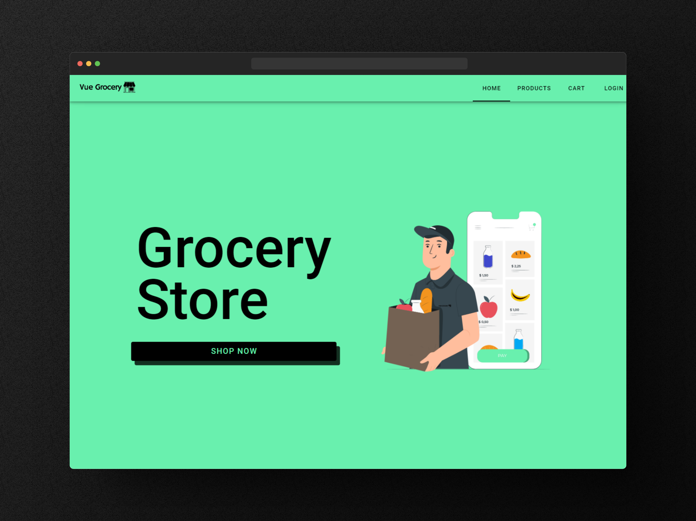

<h1 align="center"> Adega do Vilão Store 🛒🛍️ </h1>



## Introduction

Adega do Vilão Store is an eGrocery store website built using Vue 3.0, Vuetify, and Pinia. This project aims to provide a simple and user-friendly web application for online grocery shopping. The website offers a wide range of grocery products and allows customers to easily browse, add items to their cart, and complete the purchase.

## Features

- User-friendly interface for easy navigation and shopping
- Add products to the cart and manage the cart contents
- Checkout process with order summary
- Responsive design for seamless experience on various devices

## Demo
[Link to live demo](https://vue-grocery-store.vercel.app/carrinho)

## Getting Started

To get started with the Adega do Vilão Store locally on your machine, follow the instructions below.

## 📌 How to Use 

```bash
# Clone this repository
$ git clone https://github.com/Eliezir/Vue-Grocery-Store

# Go into the repository
$ cd Vue-grocery-store

# Install dependencies
$ npm install

# Run the development server
$ npm run serve
```

After executing these commands, the Adega do Vilão Store application will be up and running. You can access it by opening your web browser and navigating to `http://localhost:8080` (or the port displayed in the terminal).


## Technologies Used


The Adega do Vilão Store project utilizes the following technologies:

- [Vue.js 3.0](https://vuejs.org) : A progressive JavaScript framework for building user interfaces.
- [Vuetify](https://vuetifyjs.com/en/) : A Material Design component framework for Vue.js to create elegant and responsive UI components.
- [Pinia](https://pinia.vuejs.org) : A state management library for Vue.js applications.


<sub>Made with 💜 by <a href="https://github.com/Eliezir">Eliezir Neto</a> </sub>
